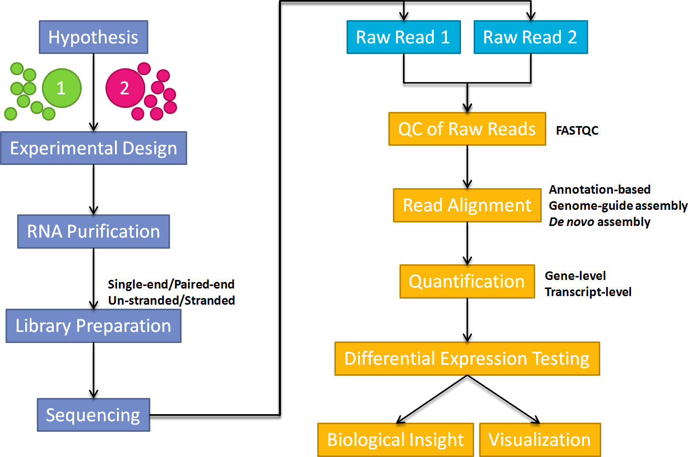
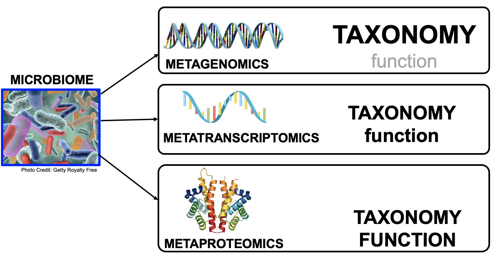
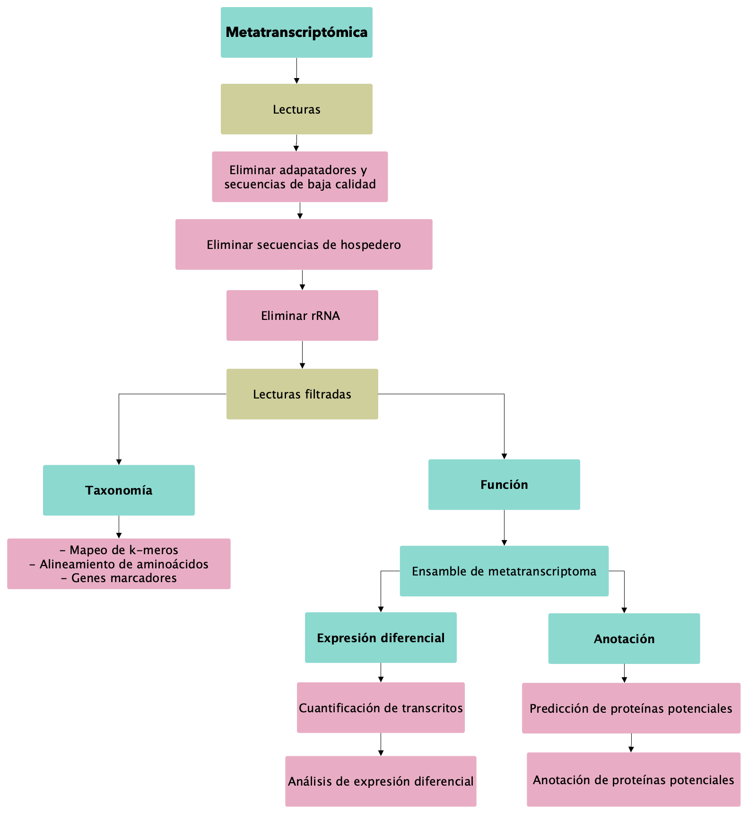

# RNA-Seq 

### Valeria Flores Almaraz
### Junio 2022


## RNA-Seq

**RNA-Seq** (RNA-sequencing) es un método que permite examinar la cantidad de secuencias de RNA en una muestra secuenciada por NGS. Esta técnica analiza el **transcriptoma**, indicando cuáles de los genes codificados en el DNA presentes en una muestra (célula, tejido, órgano, individuo) están siendo transcritos y en qué cantidad en ***determinado tiempo*** y bajo ***determinadas condiciones***. Mediante este procedimiento, podemos obtener información acerca de la función de los genes. Por ejemplo, mediante el transcriptma podemos darnos cuenta de cuáles genes de función desconocida están siendo activamente transcritos, con lo que podemos obtener pistas de su función.


## Flujo de trabajo de RNA-Seq

Un flujo de trabajo de RNA-Seq tiene varios pasos, los cuales pueden ser resumidos de manera general como:


* **Preparación de las bibliotecas**
* **Secuenciación**
* **Cuantificación de la expresión**


### Preparación de las bibliotecas
Este paso es de vital importancia y dependerá del tipo de información que se quiera obtener de nuestras muestras. Debido a que el rRNA conforma >95% del total de RNA celular, en un protocolo de RNA-seq, éste debe ser reducido o el mRNA debe ser enriquecido. El enriquecimiento del mRNA mediante selección positiva de fragmentos con terminaciones Poly-A es recomendado para la mayoría del los experimentos de RNA-Seq, pero no va a darnos información acerca de los microRNAs y otros RNAs no codificantes.


## Procesamiento de las lecturas de RNA-Seq




## Metatranscriptómica

La **metatranscriptómica** es una técnica utilizada para **identificar**, **cuantificar** y **comparar** las respuestas funcionales de las comunidades microbianas en hábitats naturales o en relación a impactos ambientales o fisiológicos.

En comparación con los estudios de **metagenómica**, la **metatrasncriptómica** nos permite conocer a los **participantes activos** en una muestra, no sólo su presencia. 




Los análisis metatranscriptómicos hacen uso de las herramientas de la metagenómica, un flujo de trabajo estándar en metatrasncritómica sería el siguiente:



# Práctica de metatranscriptómica

Para este ejercicio, haremos uso de los datos de la publicación de [Paolinelli *et al.*](https://link.springer.com/article/10.1007/s00248-021-01801-z) en el cual se analizó la composición de la comunidad de microorganismos endófifos de hojas de *Vitis vinifera* sintomáticas y asintomáticas a la enfermedad del tronco de la vid.

En total se utilizaron:

* **3 muestras de hojas sintomáticas** ***(m11, m16 y m26)***
* **3 muestras de hojas asintomáticas** ***(c22, c23 y c25)***


Los datos de este estudio se encuentran en alojados en el **ENA** *(European Nucleotide Archive)*. Se puede acceder a estos archivos [aquí](https://www.ebi.ac.uk/ena/browser/view/PRJEB31098?show=reads)

Para descargar los archivos en el cluster se puede utilizar el comando:

**¡¡NO CORRER, ESTOS ARCHIVOS YA SE ENCUENTRAN EN EL SERVIDOR!!**

```
# Descargar el archivo ERR3140239_1.fastq.gz
curl ftp://ftp.sra.ebi.ac.uk/vol1/fastq/ERR314/009/ERR3140239/ERR3140239_1.fastq.gz > ERR3140239_1.fastq.gz
```

Softwares necesarios para esta práctica:

* FastQC
* Trimmomatic
* BWA
* Samtools
* Kraken2
* KrakenTools
* SPAdes
* Salmon

Paqueterías de R:

* Tidyverse
* Pavian
* DESeq2


## Preparar directorio de trabajo y datos

El directorio en el que estaremos trabando se llama **metatrans** y tiene la siguiente estructura:

```

├── bin
└── data
    ├── annotation
    ├── assembly
    ├── count
    ├── filter
    ├── prediction
    ├── raw
    ├── taxonomy
    └── trimmed
    
```

* **bin:** En esta carpeta se alberga el código de los análisis. Mi sugerencia es tener un archivo por cada uno de los scripts, con el propósito de hacer nuestros análisis modulares.
* **data:** En esta carpeta se albergan las salidas de cada uno de los análisis. Una vez más, mi sugerencia es tener una carpeta por cada uno de los análisis, con el fin de poder acceder rápidamente a las salidas de cada análisis sin importar en qué parte del proceso vamos.

Dicho esto, hay que asegurarnos de nuestra posición:

```
pwd
#/home/vflores
```

Si no estamos en nuestro usuario, podemos regresar ahí tecleando `cd`.

* Una vez en nuestro usuario, creamos una carpeta llamada `metatrans`.
* Dentro de metatrans, creamos las carpetas `data` y `bin`

```
# Crear la carpeta metatrans
mkdir metatrans

# Crear las carpetas metatrans/bin y metatrans/data
mkdir metatrans/data metatrans/bin

```

Nos movemos al directorio `metatrans/bin`:

```
metatrans/data
```

Creamos un link simbólico hacia los archivos crudos:

```
ln -s /home/vflores/RNA/data/raw

```

Ahora nos movemos a la carpeta bin, desde donde estaremos trabajando:

```
cd ../bin
```

## Eliminar adaptadores y secuencias de baja calidad

Lo primero es crear un carpeta para albergar los análisis de las secuencias crudas:

```
mkdir ../data/rawquality
```

Ahora sí, hacemos el análisis de calidad de las secuencias crudas:

```
# Raw data fastQC analysis

for archivo in ../data/raw/ERR*.fastq.gz;
do fastqc $archivo --outdir=../data/rawquality;
done
```

Después de evaluar la calidad de las secuencias crudas, procedemos a hacer el filtro de las secuencias de baja calidad:

Primero creamos una carpeta para albergar las secuencias filtradas:

```
#Crear una carpeta para albergar secuencias filtradas
mkdir ../data/trimmed
```

Ahora corremos trimmomatic:

```
# Quality filter with Trimmomatic

for archivo in `ls ../data/raw | grep ".fastq.gz" | sed "s/_1.fastq.gz//" | sed "s/_2.fastq.gz//" | uniq`;
do trimmomatic PE -threads 4 -phred33 \
../data/raw/${archivo}_1.fastq.gz ../data/raw/${archivo}_2.fastq.gz \
../data/trimmed/${archivo}_1_paired.fastq.gz ../data/trimmed/${archivo}_1_unpaired.fastq.gz \
../data/trimmed/${archivo}_2_paired.fastq.gz ../data/trimmed/${archivo}_2_unpaired.fastq.gz \
ILLUMINACLIP:/usr/share/trimmomatic/TruSeq3-PE-2.fa:2:30:10 SLIDINGWINDOW:4:15 LEADING:5 TRAILING:5 MINLEN:25;
done

```

Evaluamos la calidad de nuestras secuencias filtradas:

Creamos una carpeta para los reportes de calidad de las secuencias filtradas:

```
mkdir ../data/filtquality
```


```
for archivo in `ls ../data/trimmed | grep ".fastq.gz" | sed "s/_1_paired.fastq.gz//"| sed "s/_2_paired.fastq.gz//" | sed "s/_1_unpaired.fastq.gz//"| sed "s/_2_unpaired.fastq.gz//"| uniq`;
do fastqc ../data/trimmed/${archivo}_1_paired.fastq.gz --outdir=../data/filtquality;
fastqc ../data/trimmed/${archivo}_2_paired.fastq.gz --outdir=../data/filtquality;
fastqc ../data/trimmed/${archivo}_1_unpaired.fastq.gz --outdir=../data/filtquality;
fastqc ../data/trimmed/${archivo}_2_unpaired.fastq.gz --outdir=../data/filtquality;
done
```

## Eliminar lecturas del hospedero 

Para eliminar las lecturas del hospedero, mapeamos nuestros archivos filtrados hacia una referencia de nuestro hospedero, en nuestro caso, la referencia es el genoma ensamblado de *Vitis vinifera*. Esto lo haremos con el programa **bwa**.


Primero, necestamos hacer un índice con nuestro genoma de referencia:

Para eso:

* Creamos una carpeta para los mapeos que se llame `mapping`
* Creamos una carpeta dentro de data que se llame `reference`.
* Crear carpeta para nuestros archivos filtrados (sin mapeo a la referencia).


```
# Crear carpeta para guardar mapeos
mkdir ../data/mapped


# Crear carpeta para nuestros archivos filtrados (sin mapeo a la referencia)
mkdir ../data/nonhost

```

Tenemos que hacer un índice con la referencia:

```
#Make host reference index
bwa index -a bwtsw ../data/reference/Vitis_vinifera.12X.dna.toplevel.fa
```

Ahora sí podemos mapear nuestras secuencias hacia la referencia:

```
for archivo in `ls ../data/trimmed | grep ".fastq.gz" | sed "s/_1_paired.fastq.gz//"| sed "s/_2_paired.fastq.gz//" | sed "s/_1_unpaired.fastq.gz//"| sed "s/_2_unpaired.fastq.gz//"| uniq`;
do bwa mem -t 4 ../data/reference/Vitis_vinifera.12X.dna.toplevel.fa ../data/trimmed/${archivo}_1_paired.fastq.gz ../data/trimmed/${archivo}_2_paired.fastq.gz > ../data/mapped/${archivo}_paired.sam;
done

```

Este proceso genera un archivo con terminación `.sam`. Para hacer más fácil trabajar con este tipo de archivos, generamos un archivo con terminación `.bam` utilizando **Samtools**:

```
#Convert .sam to .bam using samtools
for archivo in `ls ../data/trimmed | grep ".fastq.gz" | sed "s/_1_paired.fastq.gz//"| sed "s/_2_paired.fastq.gz//" | sed "s/_1_unpaired.fastq.gz//"| sed "s/_2_unpaired.fastq.gz//"| uniq`;
do samtools view -bS ../data/mapped/${archivo}_paired.sam > ../data/mapped/${archivo}_paired.bam;
done
```

A partir del archivo `.bam` podemos extraer información sobre las lecturas mapeadas, en nuestro caso, nos interesan aquellas que no mapearon a la referencia, para eso utilizamos la flag `-f 12`:

```
for archivo in `ls ../data/trimmed/ | grep ".fastq.gz" | sed "s/_1_paired.fastq.gz//"| sed "s/_2_paired.fastq.gz//" | sed "s/_1_unpaired.fastq.gz//"| sed "s/_2_unpaired.fastq.gz//"| uniq`; do samtools view -b -f 12  ../data/mapped/${archivo}_paired.bam > ../data/nonhost/${archivo}_p_um.bam; done
```

Ahora podemos guardar esas lecturas en archivos fastq:

```
for archivo in `ls ../data/trimmed/ | grep ".fastq.gz" | sed "s/_1_paired.fastq.gz//"| sed "s/_2_paired.fastq.gz//" | sed "s/_1_unpaired.fastq.gz//"| sed "s/_2_unpaired.fastq.gz//"| uniq`;
do samtools sort -n ../data/nonhost/${archivo}_p_um.bam -o ../data/nonhost/${archivo}_p_um_sorted.bam;
samtools bam2fq  ../data/nonhost/${archivo}_p_um_sorted.bam > ../data/nonhost/${archivo}_p_filtered.fastq;
done
```

Ya tenemos nuestras lecturas filtradas!

## Exploración de la la composición taxonómica
Para hacer una exploración de los hongos que están dentro de nuestras lecturas, utilizamos **Kraken2**, que es un algoritmo de clasificación basado en mapeo de *k-meros*

Kraken2 necesita una base de datos como referencia para asignar la taxonomía de las lecturas. En este ejercicio vamos a generar una base de datos que contenga las secuencias de genomas o proteínas de honos que se encuentran en el RefSeq.

Para crear la base de datos:

* Hay que crear una carpeta para albergar la base de datos
* Descargar los archivos de las bases de datos
* Construir la base de datos

```

kraken2-build --download-taxonomy --db fungi
kraken2-build --download-library fungi --db fungi
kraken2-build --build --db fungi
```

Ahora sí podemos correr el análisis de clasificación:

```
for archivo in `ls ../data/trimmed/ | grep ".fastq.gz" | sed "s/_1_paired.fastq.gz//"| sed "s/_2_paired.fastq.gz//" | sed "s/_1_unpaired.fastq.gz//"| sed "s/_2_unpaired.fastq.gz//"| uniq`;
do kraken2 --db fungi --fastq-input ../data/nonhost/${archivo}_p_filtered.fastq --threads 12 --report ../data/taxonomy/${archivo}_k2.report  --output ../data/taxonomy/${archivo}_k2.kraken;
done
```

Hacemos reportes conjuntos para cada condición (sintomático, asintomático):

```
combine_kreports.py -r ../data/taxonomy/ERR3140244_k2.report ../data/taxonomy/ERR3140243_k2.report ../data/taxonomy/ERR3140242_k2.report -o ../data/taxonomy/asymptomatic.report --only-combined --no-headers
combine_kreports.py -r ../data/taxonomy/ERR3140239_k2.report ../data/taxonomy/ERR3140240_k2.report ../data/taxonomy/ERR3140241_k2.report -o ../data/taxonomy/symptomatic.report --only-combined --no-headers
```

Descargamos estos dos archivos a un directorio de nuestra computadora a través del comand `scp`:

```
scp vflores@132.248.248.175:/home/vflores/metatrans/data/taxonomy/symptomatic.report .

scp vflores@132.248.248.175:/home/vflores/metatrans/data/taxonomy/asymptomatic.report .
```

Para esta parte, abrimos nuestro RStudio y ahí, corremos el comando:

```
pavian::runApp(port=5000,maxUploadSize=30*1024^2)
```

## Análisis de expresión diferencial
Ya que tenemos una idea de los hongos presentes en nuestras muestras, podemos hacer el análisis de expresión diferencial para conocer aquellos transcritos que están siendo diferencialmente expresados entre las hojas sintomáticas y asintomáticas. 

Primero, tenemos que construir un metratranscriptoma, para eso hay que ensamblar nuestras muestras. Para este paso utilizaremos el ensamblador **SPADes**.

Antes de correr el ensamble, hay que generar archivos con todas las muestras concatenadas. Para eso, hay que juntar nuestros archivos no mapeados y separarlos en R1 y R2 en formato `.fastq`, para este procedimiento, utilizaremos de nuevo **samtools**:

```
#Ordenar lecturas de todas las muestras
for archivo in `ls ../data/trimmed/ | grep ".fastq.gz" | sed "s/_1_paired.fastq.gz//"| sed "s/_2_paired.fastq.gz//" | sed "s/_1_unpaired.fastq.gz//"| sed "s/_2_unpaired.fastq.gz//"| uniq`;
do samtools sort ../data/nonhost/${archivo}_p_um.bam > ../data/nonhost/${archivo}_p_um_s.bam;
done

# Juntar archivos de todas las muestras
samtools merge ../data/nonhost/all.bam `find ../data/nonhost/ -name *_p_um_s.bam`

# Convertir .bam a .fastq
#Separar archivos
samtools bam2fq -1 ../data/nonhost/all_p_R1_filtered.fastq -2 ../data/nonhost/all_p_R2_filtered.fastq ../data/nonhost/all.bam

```

Ahora sí podemos hacer el ensamble del metatranscriptoma:

Creamos la carpeta que albergará el ensamble:

```
mkdir ../data/assembly
```

Corremos el ensamble:

```
spades.py --rna --12 ../data/nonhost/all_p_filtered.fastq -t 4 -k 21,33,55,77,99,111,127 -o ../data/assembly/all_assembly --
```

Ahora vamos a mapear cada una de nuestras muestras al ensamble, para eso debemos separar nuestras secuencias pareadas, repitiendo el paso anterior, para cada muestra:

```
# Separar archivos pareados
for archivo in `ls ../data/trimmed/ | grep ".fastq.gz" | sed "s/_1_paired.fastq.gz//"| sed "s/_2_paired.fastq.gz//" | sed "s/_1_unpaired.fastq.gz//"| sed "s/_2_unpaired.fastq.gz//"| uniq`;
do samtools bam2fq -1 ../data/nonhost/${archivo}_p_R1_filtered.fastq -2 ../data/nonhost/${archivo}_p_R2_filtered.fastq ../data/nonhost/${archivo}_p_um_sorted.bam;
done
```

Podemos evaluar la calidad de nuestro ensamble con el software **Quast**:

```
quast.py -t 4 ../data/assembly/all_assembly/transcripts.fasta -o ../data/assembly/
```


Para hacer la cuantificación de los transcritos utilizaromos el software **Salmon**, antes de hacer la cuantificación, tenemos que generar un índice de nuestros transcritos:

Crear una carpeta para guardar la cuantificación:

```
mkdir -p ../data/function/count
```
Generamos el índice:

```
#Índice
salmon index --index unmapped --transcripts ../data/assembly/all_assembly/transcripts.fasta
```

Corremos la cuantificación:

```
#Run salmon
for archivo in `ls ../data/trimmed/ | grep ".fastq.gz" | sed "s/_1_paired.fastq.gz//"| sed "s/_2_paired.fastq.gz//" | sed "s/_1_unpaired.fastq.gz//"| sed "s/_2_unpaired.fastq.gz//"| uniq`;
do salmon quant -i unmapped -p 2 -l A -1 ../data/nonhost/${archivo}_p_R1_filtered.fastq -2 ../data/nonhost/${sample}_p_R2_filtered.fastq -o ../data/function/count/${archivo}_quant
done
```

Una vez teniendo estos archivos, los descargamos en nuestra computadora:

```
scp -r vflores@132.248.248.175:/home/vflores/metatrans/data/function/count .
```

Ahora, abrimos nuestro RStudio, una vez ahí, cargamos las paqueterías necesarias para nuestro análisis de expresión diferencial:

```
library(tximport)
library(DESeq2)
library(tidyverse)
```

Guardamos nuestro Rscript en la carpeta que contiene la carpeta con los datos de la cuantificación, una vez ahí, establecemos nuestro directorio de trabajo a la ubicación de nuestro Rscript en: **Session > Set Workind Directory > To Source File location**.

Lo primero que hay que hacer es cargar nuestros archivos, para eso utilizaremos la paquetería **tximport:**

```
#Import files
files <- file.path("./salmon/", list.files("salmon"))
samples <- read.delim(“./metadata.csv", header=TRUE, sep=",", row.names=1) 
names(samples)[names(samples)== "conditio"] <- "Condition"
txi <- tximport(files = files, type = "salmon", txOut = T)
head(txi)
```
 
Una vez teniendo nuestros archivos, procederemos a crear nuestro objeto DESeq:
 
```
dds <- DESeqDataSetFromTximport(txi= txi,
                                colData = samples,
                                design = ~Condition)

dds
```

Nos quedamos con las secuencias que tengan al menos 10 lecturas:

```
keep <- rowSums(counts(dds)) >= 10
dds <- dds[keep,]
```

Establecemos los niveles de los tratamientos y la referencia (Por ejemplo, si quiero saber aquellos genes que están diferencialmente expresados en las hojas sintomáticas, tomo como referencia la condición asintomática):

```
dds$Condition <- relevel(dds$Condition, ref= “asymptomatic”)
```

Ahora corremos el comando para el análisis de expresión diferencial:

```
dds <- DESeq(dds)
res <- results(dds)
head(dds, tidy= TRUE)
res$pvalue
```

La medida que nos interesa es el *log2foldchange*. El *foldchange* es una medida (radio) que nos describe cuantitativamente el cambio etre una medida de referencia y otra con la que lo queramos comparar. Por ejemplo, en nuestras muestras si quisiéramos saber el cambio de las hojas sintomáticas, con respecto a las hojas asintomáticas, la operación sería: **Sintomáticas/Asintomáticas**. 

Por su parte, el *log2foldchanhe* es la transformación de nuestro *foldchange* a logaritmo base y es la medida que utiliza DESeq2 para decirnos cuánto cambió la expresión de nuestros transcritos debido a los diferentes tratamientos. Por ejemplo, si para un transcrito tuviéramos un *foldchange* de 1.5, el *log2foldchange* sería 2^1.5= 2.82, es decir, nuestro transcrito se está expresando 2.82 veces más en nuestra condición de interés con respecto a la condición de referencia.

Podemos obtener un resumen de nuestro análisis: 

```
summary(res, alpha= 0.01)
```

También podemos acceder transcritos tenemos de acuerdo a diferentes parámetros:

```
res[which(res$log2FoldChange > 1 & res$padj < .01),] #Sobrexpresado de manera diferencial

res[which(res$log2FoldChange < 1 & res$padj < .01),] #Subexpresado de manera diferencial
```


Podemos ordenar nuestros resultados para ver aquellos transcritos con *p-values* con mayor significancia:

```
res <- res[order(res$padj),]
head(res)
```

A partir de nuestros resultados, podemos hacer visualización gráfica de la cantidad de genes que están siendo diferencialmente transcritos de manera significativa, para eso podemos utilizar los llamados *volcano plots*.

Primero, vamos a generar un *dataframe* con nuestro archivo de resultados:


```
#Volcano plot
topT <- as.data.frame(res)
de <- topT[complete.cases(topT), ]
```

A partir de esta *dataframe* generamos otra columa que nos diga si los transcritos están siendo diferencialmente expresados de manera significativa y si están sobre o subexpresados:

```
de$diffexpressed <- "NO"
de$diffexpressed[de$log2FoldChange > 1 & de$padj < 0.01] <- "UP"
de$diffexpressed[de$log2FoldChange < -1 & de$padj < 0.01] <- "DOWN"
```

Ahora sí procedemos a generar la gráfica:

```
ggplot(data=de, aes(x=log2FoldChange, y=-log10(padj), col=diffexpressed)) + geom_point() +
  theme_minimal()+ geom_vline(xintercept=c(-1, 1), col="red") +
  geom_hline(yintercept=2, col="red")+
  scale_color_manual(values=c("blue", "black", "red"))
```